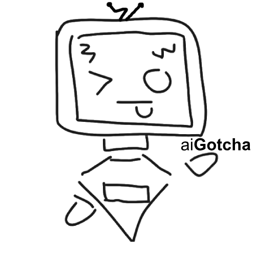

# aiGotcha

A C# WinForm application designed to detect if a certain text is made by AI.

Framework: .NET Framework 4.8

UI Framework: Siticone UI

[VirusTotal Scans](https://www.virustotal.com/gui/file/6c77d499d54fb132ecf7dbf8dc50e2431031dfc38e7f89c06d461a50da566a71)

## Installation

To install aiGotcha, simply install the aiGotcha.zip from the [Releases](https://github.com/theohasfun/aiGotcha/releases/tag/releasess).

Once downloaded, simply open up the .zip file and drag out the aiGotcha folder to your Desktop. (or any other folder :D)

Then open up aiGotcha.exe and that settles the installation!

## Usage

To use, simply copy the text you think is Ai-Generated and paste it into the TextBox.

After that, click scan.

Then a window called "Score" will appear with the score of the text.

(obviously this is detected as made by ai because it is really short and based off of 8 tokens)
